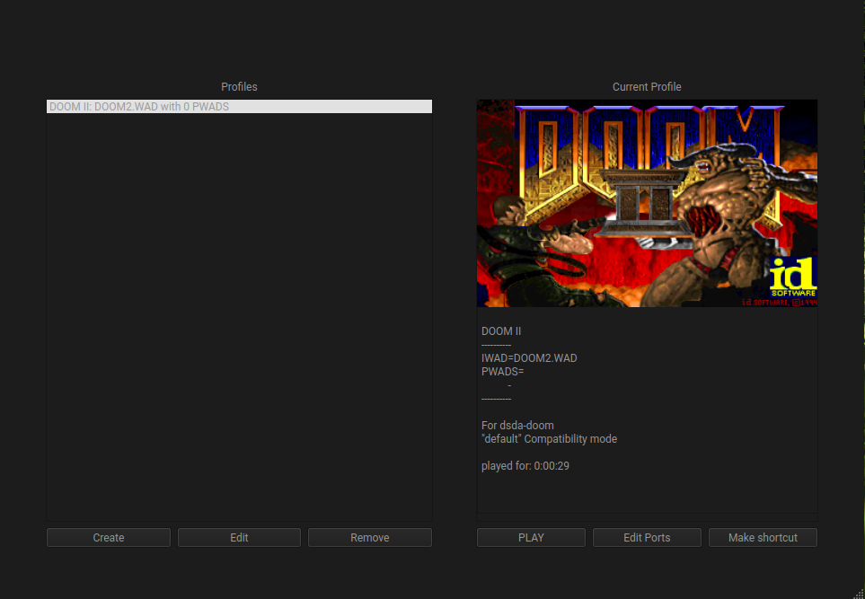

# Doom Launcher

Old implementation of a Classic Doom launcher. Mostly here for archival's sake, as I use [Doom Runner](https://github.com/Youda008/DoomRunner) now, and I'd definitely do things differently if I was making a project like this now.

## Features
- ✅ Implemented
- ⚠ Partially implemented
- ❌ Not implemented

| Feature                         | Status |
|---------------------------------|--------|
| Mod Profiles                    | ✅     |
| Per-port options                | ✅     |
| Per-port compatibility settings | ✅     |
| Profile registration            | ✅     |
| Playtime registration           | ✅     |
| Port Registration               | ⚠      |
| Shortcut generation             | ⚠      |
| Automatic compatibility         | ❌     |
| Profile filtering and sorting   | ❌     |

## Usage

If you do want to use this, make a virtual environment (or don't), install Qt5 for your system and then run `pip install -r requirements.txt`. Once that's done, run `python doomlauncher/main.py`
